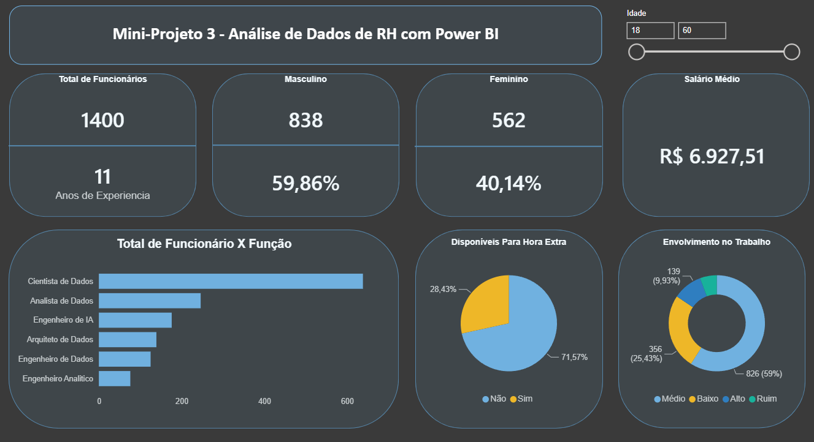

# Análise de Dados de RH com Power BI

Dashboard interativo desenvolvido no Power BI para responder perguntas estratégicas de negócio sobre o quadro de funcionários de uma empresa (dados fictícios), incluindo indicadores de força de trabalho, remuneração, engajamento e elegibilidade a promoção.

> Projeto desenvolvido como parte do curso *Microsoft Power BI para Business Intelligence e Data Science* (Data Science Academy) — Mini-Projeto 3.


<!-- Substitua pelo print real do seu dashboard -->

## 🎯 Objetivo

Construir um dashboard capaz de responder, de forma visual e interativa, às principais perguntas de negócio de um time de RH sobre o perfil da força de trabalho da empresa.

## ❓ Perguntas de negócio respondidas

1. Qual o total de funcionários atualmente na empresa?
2. Qual o tempo médio de experiência dos funcionários (em anos)?
3. Qual o total e percentual de funcionários por gênero (masculino/feminino)?
4. Qual a média salarial mensal?
5. Qual o total de funcionários por função?
6. Qual o percentual de funcionários disponíveis para hora extra?
7. Qual o nível de envolvimento dos funcionários no trabalho (Ruim, Baixo, Médio, Alto)?
8. **Cálculo adicional (fora do dashboard):** qual o total e percentual de funcionários elegíveis a promoção — considerando funcionários com 5 anos ou mais desde a última promoção?

## 📊 Principais indicadores (KPIs)

| Indicador | Valor |
|---|---|
| Total de funcionários | 1.400 |
| Funcionários - Masculino | 838 (59,86%) |
| Funcionários - Feminino | 562 (40,14%) |
| Salário médio mensal | R$ 6.927,51 |
| Experiência média | 11 anos |
| Envolvimento no trabalho (Médio) | 826 (59%) |
| Disponíveis para hora extra | 28,43% |

## 🛠️ Técnicas e recursos aplicados

- **Colunas calculadas (Power Query / DAX)** para categorização de dados
- **Coluna condicional** para classificação de elegibilidade a promoção
- **Tabela de medidas (measure table)** dedicada para organizar os KPIs
- **DAX** para cálculos condicionais (ex: regra dos "5 anos desde a última promoção")
- **Segmentação de dados (slicer)** por faixa etária
- Visuais: cartões (cards), gráfico de barras, gráfico de rosca (donut) e gráfico de pizza

## 🔍 Principais insights

- A força de trabalho é majoritariamente masculina (~60%), mas com uma parcela feminina relevante (~40%).
- A maioria dos funcionários (59%) apresenta nível de envolvimento **médio** no trabalho, o que aponta oportunidade de ações de engajamento.
- Apenas ~28% dos funcionários estão disponíveis para hora extra, um dado importante para planejamento de capacidade.
- **247 funcionários (17,64%) devem ser considerados para promoção**, com base na regra de negócio (5 anos ou mais desde a última promoção). Esse cálculo foi feito fora do dashboard principal, como uma medida DAX auxiliar (`TotalPromover` / `PorcentagemPromover`).

## 🧮 Medidas DAX criadas

| Medida | Expressão |
|---|---|
| `TotalFunc` | `COUNTROWS(DatasetRH)` |
| `TotalMasculino` / `TotalFeminino` | `CALCULATE([TotalFunc], DatasetRH[Genero] = "Masculino"/"Feminino")` |
| `PorcentagemMasc` / `PorcentagemFem` | `DIVIDE([TotalMasculino], [TotalFunc])` |
| `SalarioMedio` | `AVERAGE(DatasetRH[Salario_Mensal])` |
| `AnosExperiencia` | `AVERAGE(DatasetRH[Anos_Experiencia])` |
| `TotalPromover` | `CALCULATE([TotalFunc], DatasetRH[StatusPromo] = "Considerar Promoção")` |
| `PorcentagemPromover` | `DIVIDE([TotalPromover], [TotalFunc])` |

> A coluna `StatusPromo` foi criada como **coluna condicional** no Power Query/DAX, aplicando a regra: se `Anos_Desde_Ultima_Promocao >= 5`, marca como "Considerar Promoção"; caso contrário, "Não Considerar Promoção".

## 🗂️ Estrutura do repositório

```
├── DadosRH.pbix          # Arquivo do Power BI
├── imagens/               # Prints do dashboard
└── README.md
```

## 📁 Sobre os dados

Os dados utilizados são **fictícios**, fornecidos como parte do material didático da Data Science Academy, usados exclusivamente para fins de aprendizado e demonstração de habilidades técnicas.

## 🚀 Como visualizar

1. Baixe o arquivo `DadosRH.pbix`
2. Abra no [Power BI Desktop](https://powerbi.microsoft.com/desktop/) (gratuito)
3. Explore os filtros interativos (ex: faixa etária)

---
*Desenvolvido por [seu nome] — [link do LinkedIn]*
